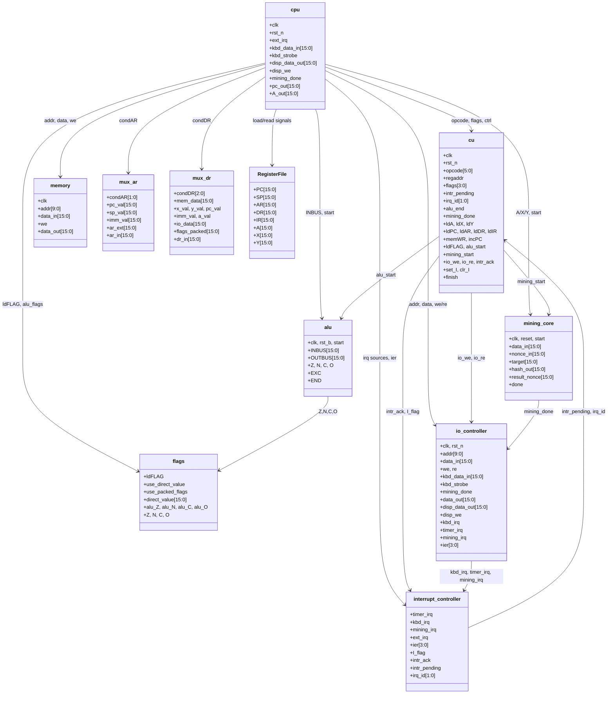
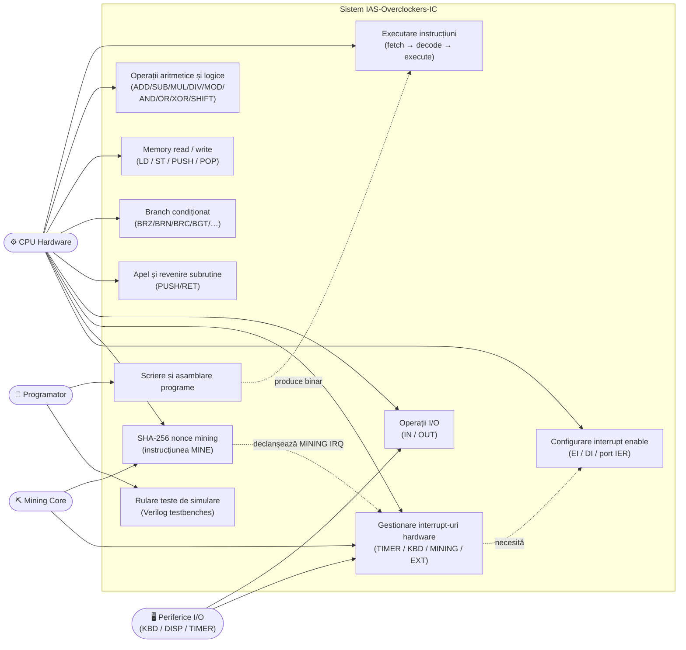
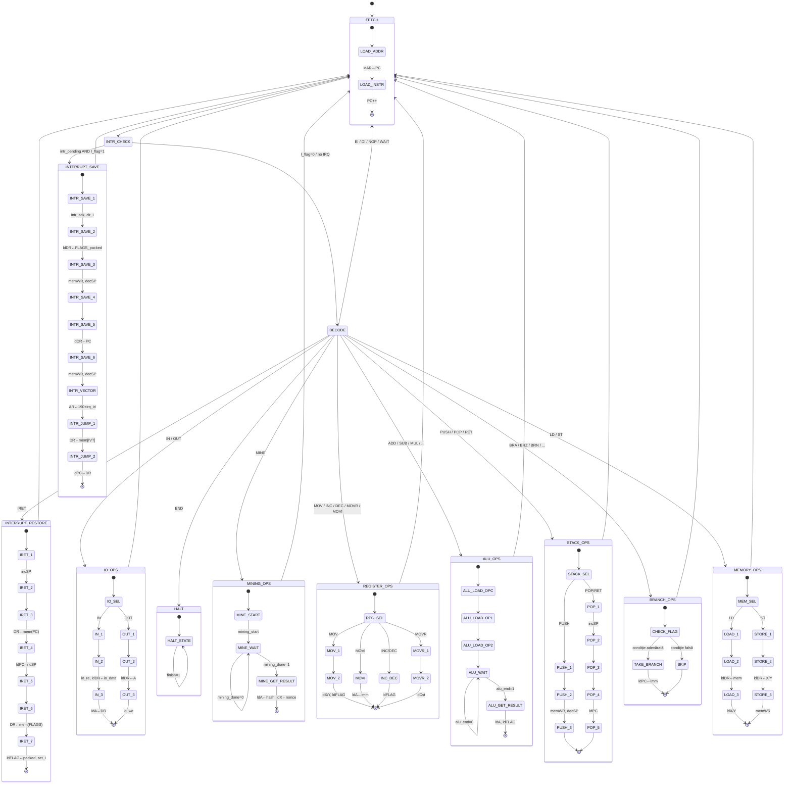

# IAS-Overclockers-IC — Specificație Milestone

> **Milestone:** CPU complet cu sistem I/O, Interrupt Controller și SHA-256 Mining Accelerator
> **Data:** 2026-04-10
> **Limbaje de implementare:** Verilog (simulare), Python (assembler)

---

## Cuprins
1. [Prezentare generală](#1-prezentare-generală)
2. [Specificații de arhitectură](#2-specificații-de-arhitectură)
3. [Instruction Set Architecture (ISA)](#3-instruction-set-architecture-isa)
4. [Descrierea modulelor](#4-descrierea-modulelor)
5. [Diagrame UML](#5-diagrame-uml)
   - [5.1 Diagrama de componente / module](#51-diagrama-de-componente--module-stil-uml-clase)
   - [5.2 Diagrama de cazuri de utilizare](#52-diagrama-de-cazuri-de-utilizare)
   - [5.3 Diagrama de stări FSM](#53-diagrama-de-stări-fsm-unitatea-de-control)
6. [Harta memoriei și I/O](#6-harta-memoriei-și-io)
7. [Sistemul de întreruperi](#7-sistemul-de-întreruperi)
8. [Acoperire teste](#8-acoperire-teste)

---

## 1. Prezentare generală

**IAS-Overclockers-IC** este un procesor educațional de 16 biți implementat în Verilog, bazat pe arhitectura Von Neumann (memorie unificată). Extinde un design clasic bazat pe accumulator cu:

- Un **ISA de 54 instrucțiuni de bază** (extins la **60 instrucțiuni** cu I/O și interrupt control)
- Un **Finite State Machine cu 98 de stări** în unitatea de control
- Un **SHA-256 proof-of-work mining accelerator** hardware (extensie ASIP)
- **Memory-Mapped I/O (MMIO)** cu periferice: keyboard, display și timer
- Un **interrupt controller hardware cu 4 surse** și arbitraj cu prioritate fixă

| Proprietate | Valoare |
|---|---|
| Arhitectură | Von Neumann (memorie unificată instrucțiuni + date) |
| Lățime date | 16 biți |
| Address bus | 10 biți (RAM) / 10 biți (spațiu I/O) |
| Dimensiune memorie | 1024 × cuvinte de 16 biți |
| Lățime instrucțiune | 16 biți (fixă) |
| Total instrucțiuni | 60 |
| Stări FSM | 98 (stările 0–97) |
| Surse de interrupt | 4 (TIMER, KBD, MINING, EXT) |
| Extensie ASIP | SHA-256 mining core |
| Assembler | Python 2 pași, cu suport etichete |

---

## 2. Specificații de arhitectură

### 2.1 Register File

| Registru | Lățime | Descriere |
|---|---|---|
| **A** | 16 biți | Accumulator — operand principal și rezultat ALU |
| **X** | 16 biți | Registru de uz general (operand 2 ALU, index memorie) |
| **Y** | 16 biți | Registru de uz general (operand 2 ALU, index memorie) |
| **PC** | 16 biți | Program Counter (indică instrucțiunea următoare) |
| **SP** | 16 biți | Stack Pointer (crește descendent) |
| **AR** | 16 biți | Address Register (comandă address bus-ul) |
| **DR** | 16 biți | Data Register (buffer pentru data bus) |
| **IR** | 16 biți | Instruction Register (conține instrucțiunea fetch-uită) |
| **FLAGS** | 4 biți | Condition codes: Z (zero), N (negative), C (carry), O (overflow) |
| **I_flag** | 1 bit | Global interrupt enable (setat de EI, resetat de DI/intrare interrupt) |

### 2.2 Codificarea instrucțiunilor

```
 15      10  9   8                   0
 ┌────────┬───┬───────────────────────┐
 │ opcode │ r │      operand          │
 │ 6 biți │1b │      9 biți           │
 └────────┴───┴───────────────────────┘

opcode[5:0] = IR[15:10]   — opcode pe 6 biți
regaddr     = IR[9]        — 0 = registrul X, 1 = registrul Y
operand     = IR[8:0]      — immediate pe 9 biți (sign-extended la 16 biți) sau adresă
```

Pentru instrucțiunile I/O (IN/OUT), cei 10 biți completi IR[9:0] codifică adresa portului.

### 2.3 Operațiile ALU

ALU este o unitate multi-cycle cu 13 tipuri de operații:

| Categorie | Operații |
|---|---|
| Aritmetice | ADD, SUB, MUL (semnat), DIV (semnat SRT-4), MOD |
| Logice | AND, OR, XOR, NOT |
| Shift/Rotate | LSL (logical shift left), LSR (logical shift right), RSL (rotate left), RSR (rotate right) |
| Comparație | CMP (A − op, doar flags), TST (A & op, doar flags) |

---

## 3. Instruction Set Architecture (ISA)

### 3.1 Control flow — 15 instrucțiuni

| Mnemonic | Opcode (bin) | Operand | Descriere |
|---|---|---|---|
| HALT / END | 000000 | — | Oprire execuție |
| NOP | 100010 | — | No operation |
| BRA | 000011 | adresă 10 biți | Branch necondiționat |
| BRZ | 000100 | adresă 10 biți | Branch dacă Z=1 |
| BRN | 000101 | adresă 10 biți | Branch dacă N=1 |
| BRC | 000110 | adresă 10 biți | Branch dacă C=1 |
| BRO | 000111 | adresă 10 biți | Branch dacă O=1 |
| BNE | 100101 | adresă 10 biți | Branch dacă Z=0 |
| BGT | 011110 | adresă 10 biți | Branch dacă ¬Z ∧ (N=O) |
| BLT | 011111 | adresă 10 biți | Branch dacă N≠O |
| BGE | 100000 | adresă 10 biți | Branch dacă N=O |
| BLE | 100001 | adresă 10 biți | Branch dacă Z ∨ (N≠O) |
| PUSH (CALL) | 100011 | X/Y (bit registru) | Push PC, încarcă noul PC din X/Y |
| POP / RET | 001001 | — | Pop PC din stack |
| WAIT | 111011 | — | Idle până la interrupt |

### 3.2 Operații cu memoria — 8 instrucțiuni

| Mnemonic | Opcode (bin) | Operand | Descriere |
|---|---|---|---|
| LD X | 000001 | 0 + adresă 9 biți | X ← mem[addr] |
| LD Y | 000001 | 1 + adresă 9 biți | Y ← mem[addr] |
| ST X | 000010 | 0 + adresă 9 biți | mem[addr] ← X |
| ST Y | 000010 | 1 + adresă 9 biți | mem[addr] ← Y |

> **Limitare adresare directă**: câmpul de adresă din instrucțiune are 9 biți (IR[8:0]), deci LD/ST pot accesa direct doar locațiile **0x000–0x1FF** (primele 512 cuvinte). Jumătatea superioară a memoriei (0x200–0x3FF) este accesibilă indirect prin registrele X/Y folosite ca pointer (ex. `LD X` după o instrucțiune care încarcă adresa dorită). Instrucțiunile de salt folosesc 10 biți (IR[9:0]) și pot atinge toată memoria.
| PUSH X | 100011 | 0 + zeros | mem[SP] ← X, SP-- |
| PUSH Y | 100011 | 1 + zeros | mem[SP] ← Y, SP-- |
| POP X | 100100 | 0 + zeros | X ← mem[++SP] |
| POP Y | 100100 | 1 + zeros | Y ← mem[++SP] |

### 3.3 ALU — Operand registru — 7 instrucțiuni

| Mnemonic | Opcode (bin) | Semantică |
|---|---|---|
| ADD | 001010 | A ← A + X/Y |
| SUB | 001011 | A ← A − X/Y |
| MUL | 001100 | A ← A × X/Y (semnat) |
| DIV | 001101 | A ← A ÷ X/Y (semnat) |
| MOD | 001110 | A ← A mod X/Y |
| INC | 011010 | X/Y ← X/Y + 1 |
| DEC | 011011 | X/Y ← X/Y − 1 |

### 3.4 ALU — Immediate operand — 6 instrucțiuni

| Mnemonic | Opcode (bin) | Semantică |
|---|---|---|
| MOVI | 111001 | A ← sign_ext(imm9) |
| ADDI | 101010 | A ← A + imm9 |
| SUBI | 101011 | A ← A − imm9 |
| MULI | 101100 | A ← A × imm9 |
| DIVI | 101101 | A ← A ÷ imm9 |
| MODI | 101110 | A ← A mod imm9 |

### 3.5 Shift / Rotate — Registru și immediate — 8 instrucțiuni

| Mnemonic | Opcode (bin) | Semantică |
|---|---|---|
| LSL | 001111 | A ← A << X/Y |
| LSR | 010000 | A ← A >> X/Y (logical) |
| RSL | 010010 | A ← rotate_left(A, X/Y) |
| RSR | 010001 | A ← rotate_right(A, X/Y) |
| LSLI | 101111 | A ← A << imm9 |
| LSRI | 110000 | A ← A >> imm9 |
| RSLI | 110010 | A ← rotate_left(A, imm9) |
| RSRI | 110001 | A ← rotate_right(A, imm9) |

### 3.6 Logice — Registru și immediate — 8 instrucțiuni

| Mnemonic | Opcode (bin) | Semantică |
|---|---|---|
| AND | 010011 | A ← A & X/Y |
| OR | 010100 | A ← A \| X/Y |
| XOR | 010101 | A ← A ^ X/Y |
| NOT | 010110 | A ← ~A |
| ANDI | 110011 | A ← A & imm9 |
| ORI | 110100 | A ← A \| imm9 |
| XORI | 110101 | A ← A ^ imm9 |
| NOTI | 110110 | A ← ~A |

### 3.7 Comparație — 4 instrucțiuni

| Mnemonic | Opcode (bin) | Semantică |
|---|---|---|
| CMP | 010111 | FLAGS ← eval(A − X/Y), A neschimbat |
| TST | 011000 | FLAGS ← eval(A & X/Y), A neschimbat |
| CMPI | 110111 | FLAGS ← eval(A − imm9) |
| TSTI | 111000 | FLAGS ← eval(A & imm9) |

### 3.8 Transfer registre — 2 instrucțiuni

| Mnemonic | Opcode (bin) | Semantică |
|---|---|---|
| MOV X/Y | 011001 | X/Y ← sign_ext(imm9); actualizează FLAGS |
| MOVR | 011101 | dst_reg ← src_reg (orice pereche: A, X, Y, PC) |

### 3.9 I/O — 2 instrucțiuni

| Mnemonic | Opcode (bin) | Semantică |
|---|---|---|
| IN | 100110 | A ← io_port[IR[9:0]] |
| OUT | 100111 | io_port[IR[9:0]] ← A |

### 3.10 Interrupt control — 4 instrucțiuni

| Mnemonic | Opcode (bin) | Semantică |
|---|---|---|
| EI | 101000 | I_flag ← 1 (enable interrupts) |
| DI | 101001 | I_flag ← 0 (disable interrupts) |
| IRET | 111010 | Restore PC + FLAGS din stack; I_flag ← 1 |
| WAIT | 111011 | Idle în starea 97 până la intr_pending |

### 3.11 Extensie ASIP — 1 instrucțiune

| Mnemonic | Opcode (bin) | Intrări | Ieșiri | Descriere |
|---|---|---|---|---|
| MINE | 011100 | A=target, X=data, Y=nonce | A=hash, X=nonce_găsit | Execută căutare nonce SHA-256 |

---

## 4. Descrierea modulelor

| Modul | Fișier | Rol |
|---|---|---|
| `cpu` | CPU/cpu.v | Integrare top-level: interconectează toate sub-modulele |
| `cu` | CPU/cu.v | FSM cu 98 stări — secvențiere, generare semnale de control |
| `alu` | CPU/alu.v | Unitate aritmetică/logică multi-cycle pe 16 biți |
| `memory` | CPU/memory.v | RAM sincron dual-port 1024×16 |
| `flags` | CPU/flags.v | Registru condition codes (Z, N, C, O) cu 3 moduri de load |
| `mining_core` | CPU/mining_core.v | SHA-256 accelerator cu buclă de căutare nonce |
| `io_controller` | CPU/io_controller.v | Hub periferice MMIO: porturi KBD, DISP, TIMER, IER, IFR, MINE |
| `interrupt_controller` | CPU/interrupt_controller.v | Priority encoder cu 4 surse și mascare prin IER |
| `mux_ar` | CPU/mux_ar.v | Selectare sursă AR: PC / SP / IMM / IO_EXT |
| `mux_dr` | CPU/mux_dr.v | Selectare sursă DR: mem / X / Y / PC / IMM / A / io / FLAGS |
| `mux_alu` | CPU/mux_alu.v | Selectare operanzi ALU |
| `rca` | CPU/rca.v | Ripple-carry adder pe 17 biți |
| `barrel_shifter` | CPU/barrel_shifter.v | Shift/rotate combinațional (LSL/LSR/RSL/RSR) |
| `logic_unit` | CPU/logic_unit.v | AND / OR / XOR / NOT |
| Assembler | CPU-Assembler/main.py | Assembler Python în 2 pași, cu suport etichete |

---

## 5. Diagrame UML

### 5.1 Diagrama de componente / module (stil UML clase)



---

### 5.2 Diagrama de cazuri de utilizare


---

### 5.3 Diagrama de stări FSM (Unitatea de control)


---

## 6. Harta memoriei și I/O

### 6.1 Memory map (1024 × cuvinte de 16 biți)

| Interval adrese | Regiune | Descriere |
|---|---|---|
| 0 – 189 | **Program** | Instrucțiuni încărcate de assembler |
| 190 | **IVT[0]** | Adresa ISR pentru TIMER |
| 191 | **IVT[1]** | Adresa ISR pentru KBD |
| 192 | **IVT[2]** | Adresa ISR pentru MINING |
| 193 | **IVT[3]** | Adresa ISR pentru EXT |
| 194 – 199 | Rezervat | — |
| 200 – 1023 | **Date** | Variabile, stack, heap |

Stack-ul crește descendent de la o adresă mare din zona de date. SP este inițializat de program.

### 6.2 I/O port map (MMIO pe 10 biți, rutat prin AR[10]=1)

| Port | Hex | R/W | Registru | Descriere |
|---|---|---|---|---|
| 0 | 0x000 | R | KBD_DATA | Codul ASCII al ultimei taste apăsate |
| 1 | 0x001 | R | KBD_STATUS | bit[0]=tastă disponibilă (citirea șterge latch-ul) |
| 16 | 0x010 | W | DISP_DATA | Scriere caracter pe display |
| 17 | 0x011 | R | DISP_STATUS | Display ready (mereu 0) |
| 32 | 0x020 | R/W | TIMER_CTRL | bit[0]=enable, bit[1]=periodic |
| 33 | 0x021 | R/W | TIMER_PERIOD | Valoare de reload (16 biți) |
| 34 | 0x022 | R | TIMER_COUNT | Valoarea curentă a counter-ului |
| 48 | 0x030 | R/W | IER | Interrupt Enable: [0]=TIMER,[1]=KBD,[2]=MINING,[3]=EXT |
| 49 | 0x031 | R | IFR | Interrupt Flags (status, doar citire) |
| 64 | 0x040 | R | MINE_HASH | Rezultatul hash SHA-256 (citirea șterge mining_irq) |
| 65 | 0x041 | R | MINE_NONCE | Valoarea nonce-ului găsit |

---

## 7. Sistemul de întreruperi

### 7.1 Surse de interrupt și priorități

| ID | Sursă | Prioritate | Trigger | Adresă IVT | Bit IER |
|---|---|---|---|---|---|
| 0 | TIMER | 1 (cea mai mare) | Counter == period (pulse) | mem[190] | IER[0] |
| 1 | KBD | 2 | Rising edge kbd_strobe | mem[191] | IER[1] |
| 2 | MINING | 3 | Rising edge mining_done | mem[192] | IER[2] |
| 3 | EXT | 4 (cea mai mică) | Pin ext_irq la nivel high | mem[193] | IER[3] |

### 7.2 Ciclul de viață al unui interrupt

```
Sursa IRQ se activează
       │
       ▼
io_controller latchează flag-ul IRQ
       │
       ▼
interrupt_controller: mascare IER + priority encoding
       │
       ▼ intr_pending=1, irq_id[1:0]
       │
[După LOAD_INSTR, în starea INTR_CHECK]
       │
       ├── I_flag=0 → DECODE (IRQ ignorat)
       │
       └── I_flag=1 → secvența INTERRUPT_SAVE:
               push FLAGS (packed) pe stack
               push PC pe stack
               clr_I, intr_ack → latch sursă șters
               AR ← 190 + irq_id
               PC ← mem[AR] (jump la ISR)
               │
              [ISR se execută, poate folosi IN/OUT]
               │
              IRET:
               pop PC din stack
               pop FLAGS din stack
               set_I ← 1
               reia instrucțiunea întreruptă
```

### 7.3 Flags packing (pentru IRET)

FLAGS sunt salvate în nibble-ul superior al cuvântului din stack:

```
 15  14  13  12  11             0
 ┌───┬───┬───┬───┬───────────────┐
 │ Z │ N │ C │ O │  (zeros)      │
 └───┴───┴───┴───┴───────────────┘
```

---

## 8. Acoperire teste

### 8.1 Inventar testbench-uri

| Testbench | Tip | Acoperire |
|---|---|---|
| cpu_tb.v | Integrare | 110 cazuri — toate instrucțiunile de bază + EI/DI/OUT/IN, generare flags |
| cpu_interrupt_tb.v | Integrare | 17 cazuri — save/restore context, IRET; ISR-uri EXT/KBD/TIMER; arbitraj prioritate |
| cu_interrupt_tb.v | FSM | Stările 72–97: căi FSM I/O și interrupt |
| io_controller_tb.v | Periferic | 44 cazuri — toate adresele de port, KBD/DISP/TIMER/MINE; verificare mascare IER |
| interrupt_controller_tb.v | Periferic | Arbitraj prioritate, mascare IER, intr_ack |
| mining_core_tb.v | ASIP | Corectitudine hash SHA-256, căutare nonce |
| flags_tb.v | Unitar | Z/N/C/O în toate modurile: ALU, direct, packed |
| alu_tb.v | Unitar | Toate cele 13 tipuri de operații cu cazuri limită |
| rca_tb.v | Unitar | Propagarea carry |
| barrel_shifter_tb.v | Unitar | Toate direcțiile shift/rotate |
| mux_ar/dr/alu_tb.v | Unitar | Corectitudine selecție multiplexor |
| register_x/y/accumulator_tb.v | Unitar | Operații load, increment, decrement |

**Total: 27 testbench-uri module + cpu_tb.v integrare = 645+ cazuri de test (toate PASS)**

### 8.2 Teste assembler

| Fișier | Scop |
|---|---|
| assembler_test.py | Suită de teste pentru cele 54 instrucțiuni de bază |
| assembler_test_extended.py | Set extins cu instrucțiuni I/O și interrupt control |
| test_input_extended.asm | Referință codificare instrucțiuni extinse |

### 8.3 Programe demo

| Fișier | Demonstrează |
|---|---|
| io_interrupt_demo.asm | Interrupt-uri TIMER + KBD, WAIT, ISR cu IN/OUT |
| program1–5.asm | Aritmetică, branch-uri, bucle, operații registre, validare mixtă |

---

*Documentație milestone proiect IAS-Overclockers-IC*
